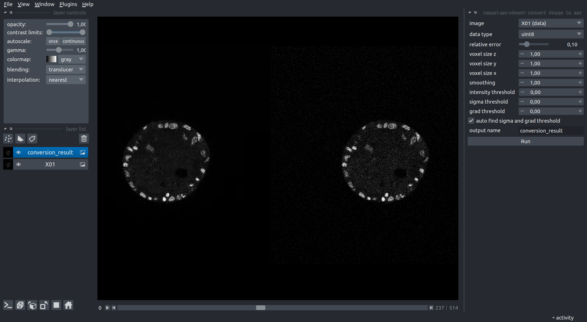
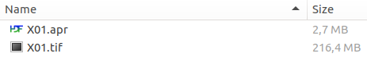
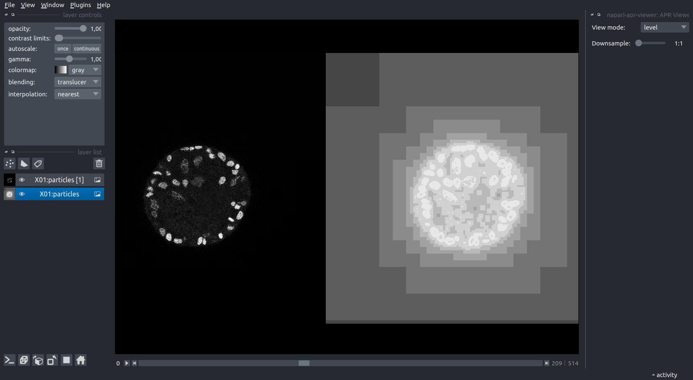
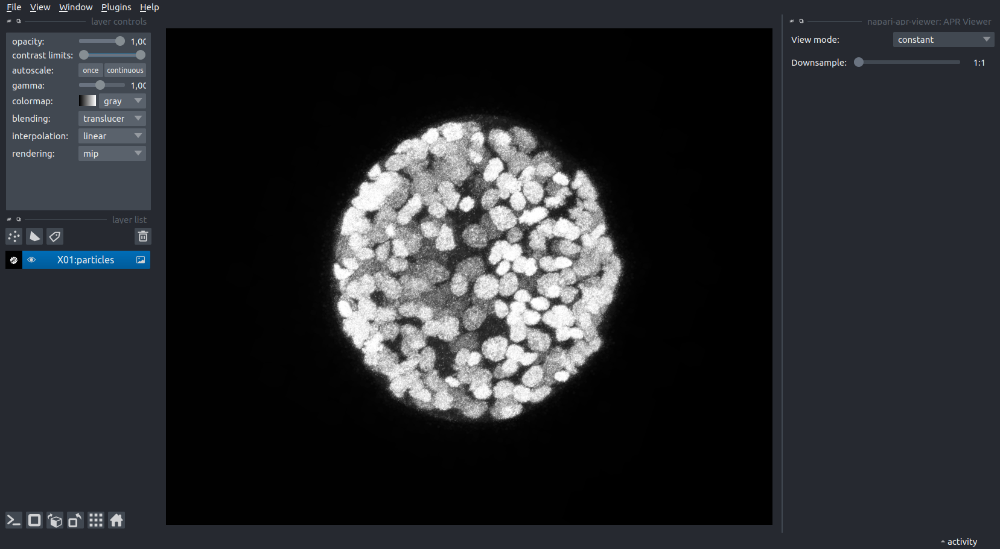
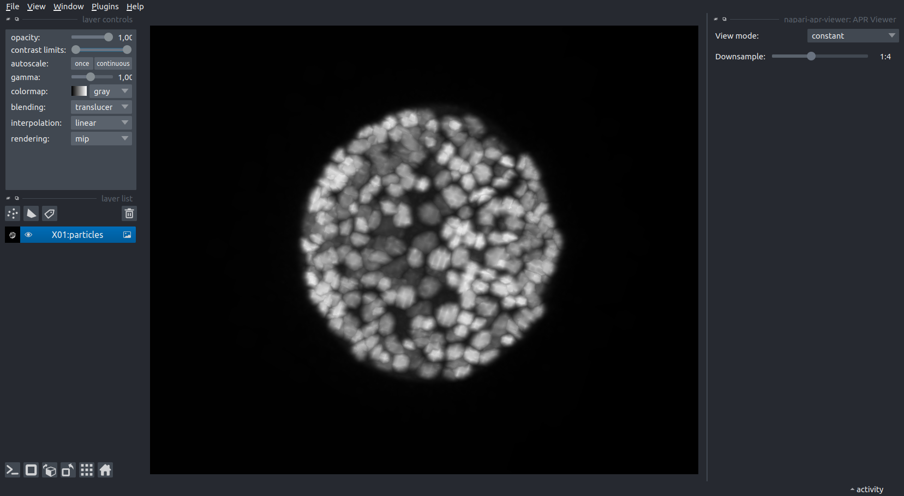

# napari-apr-viewer

A simple plugin to create and view APR images in napari

## Usage

To get started, open an image of your choice (2D or 3D grayscale) in napari and open the `convert_image_to_apr` panel. Select the image layer to convert, an appropriate data type, and hit `Run`. 

**Note:** choosing a data type smaller than the input type may lead to overflow and thus erroneous results.

Conversion parameters can often be left to their default values, thanks to the automatic parameter tuning. For very noisy images, it is sometimes useful to increase the `smoothing` parameter. In order to get a more (or less) aggressive adaptation, change the `relative error` parameter.

To save the result to file, simply save the newly created layer using the `File` menu. We use the extension `.apr`, although the file is actually written in `hdf5` format (and can be opened/explored as such). In this example, the APR is roughly 80 times smaller than the original image on disk. APR files can be opened directly in napari, e.g. by drag and drop.

To better understand the workings of the APR on your data, you can use the `APR Viewer` panel to change the `View mode` for a selected APR layer to `level`. This shows you a visualization of the adaptive resolution. Particles in the brightest regions correspond exactly to pixels (lossless), while each shade darker corresponds to downsampling by a factor of 2 in each dimension.

The `Downsample` slider can be used to reduce the resolution of the displayed data for the selected layer. This can be used to explore large volumes in 3D, where rendering the full data requires too much memory. 

**Note:** We do not offer APR-native rendering at this time, so this step will reconstruct the entire pixel volume (at the selected resolution). Thus, for large volumes, be sure to increase the downsampling before toggling the 3D viewer. 

_The data shown in these examples was taken from the Platynereis-ISH-Nuclei-CBG dataset available [here](https://github.com/juglab/EmbedSeg/releases)._

&nbsp;

----------------------------------

This [napari] plugin was generated with [Cookiecutter] using [@napari]'s [cookiecutter-napari-plugin] template.

## Installation

You can install `napari-apr-viewer` via [pip]:

    pip install napari-apr-viewer

## Contributing

Contributions are very welcome. Tests can be run with [tox], please ensure
the coverage at least stays the same before you submit a pull request.

## License

Distributed under the terms of the [Apache Software License 2.0] license,
"napari-apr-viewer" is free and open source software

## Issues

If you encounter any problems, please [file an issue] along with a detailed description.

[napari]: https://github.com/napari/napari
[Cookiecutter]: https://github.com/audreyr/cookiecutter
[@napari]: https://github.com/napari
[MIT]: http://opensource.org/licenses/MIT
[BSD-3]: http://opensource.org/licenses/BSD-3-Clause
[GNU GPL v3.0]: http://www.gnu.org/licenses/gpl-3.0.txt
[GNU LGPL v3.0]: http://www.gnu.org/licenses/lgpl-3.0.txt
[Apache Software License 2.0]: http://www.apache.org/licenses/LICENSE-2.0
[Mozilla Public License 2.0]: https://www.mozilla.org/media/MPL/2.0/index.txt
[cookiecutter-napari-plugin]: https://github.com/napari/cookiecutter-napari-plugin

[napari]: https://github.com/napari/napari
[tox]: https://tox.readthedocs.io/en/latest/
[pip]: https://pypi.org/project/pip/
[PyPI]: https://pypi.org/

[file an issue]: https://github.com/AdaptiveParticles/napari-apr-viewer/issues
